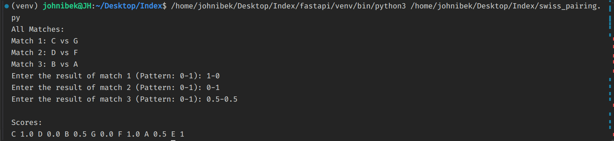

# README
## SETUP

1. #### Create virtual environment and activate it
`python3 -m venv venv`

`source venv/bin/activate`

2. #### Install requirements

`pip install -r requirements.txt`

3. #### Make Migrations

`python manage.py makemigrations`

`python manage.py migrate`

## URL for api docs in swagger:
http://127.0.0.1:8000/docs

## Python code for pairing
```python
class Player:
    def __init__(self, name, rating=0):
        self.name = name
        self.rating = rating
        self.score = 0

    def __repr__(self):
        return f"{self.name} ({self.score})"
    

def swiss_pairing(players):
    players.sort(key=lambda x: (-x.rating, x.name))

    mid = len(players) // 2  # 16//2 = 8 -> 0-7, 8-15.   17//2 = 8 -> 0-7, 8-15 16->bye

    end = len(players)
    
    if len(players) % 2 == 1:
        end = len(players) - 1
        players[end].score += 1
    
    first_half = players[:mid]
    second_half = players[mid:end]

    pairs = []  # [(p3, p7), (p4, p6), (p2, p1)]

    for i, (player1, player2) in enumerate(zip(first_half, second_half)):
        pairs.append([player1, player2])
        print(f"Match {i+1}: {player1.name} vs {player2.name}")
    

    for i in range(mid):
        result = input(f"Enter the result of match {i+1} (Pattern: 0-1): ").split("-")
        
        for j in pairs:
            j[0].score += float(result[0])
            j[1].score += float(result[1])


p1 = Player("A", 1200)
p2 = Player("B", 1800)
p3 = Player("C", 2100)
p4 = Player("D", 1900)
p5 = Player("E", 800)
p6 = Player("F", 1250)
p7 = Player("G", 1300)


all_players = [p1, p2, p3, p4, p5, p6, p7]

print("All Matches:")
swiss_pairing(all_players)
print()


print("Scores:")
for player in all_players:
    print(player.name, player.score, end=" ")
print()
```

